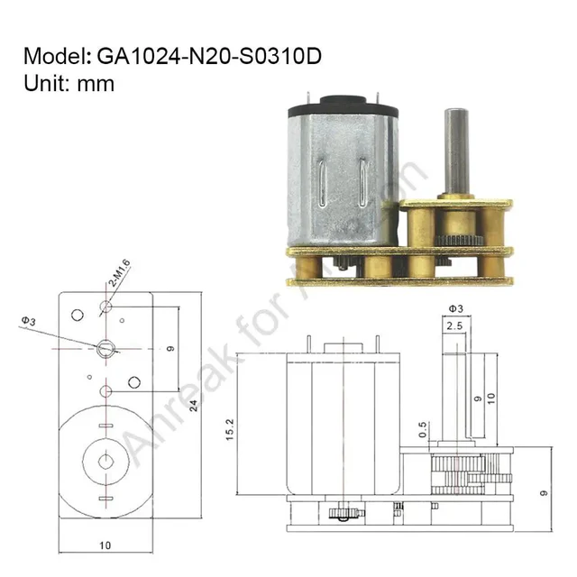

# Filament Guillotine

A filament cutter designed to work with any 3D printer print head. It cuts filament cleanly so toolheads and printers can share or swap filament more reliably.

**Discord:** [https://discord.gg/fSPVZBNUWa](https://discord.gg/fSPVZBNUWa) — development discussion and project updates live here.

## Files

| Folder | Contents |
|--------|----------|
| `STL/` | Printable STL parts |
| `CAD/` | STEP exports for editing |
| `Filament Guillotine.f3d` | Fusion 360 source |

### Printable parts

- Cutter Housing
- Housing
- Inner Body
- Pusher

## Parts list

Hardware and bought parts will be listed here as they are confirmed.

| Part | Qty | Notes / link |
|------|-----|--------------|
| KM-1020FN20-103-05185 geared motor | 1 | [AliExpress](https://www.aliexpress.us/item/3256809224168887.html) · [datasheet](docs/KM-1020FN20-103-05185.png) |
| Bolt D2.5 × M2 × 20 mm | 1 | |
| Bolt D2.5 × M2 × 25 mm | 1 | |
| #4 scalpel blade | 1 | AliExpress |

### Motor

N20-style micro DC geared motor with D-shaft output.

## Status

CAD and STL files are in the repo. Bill of materials is still being collected.

## License

This project uses **strong open / copyleft licenses** by file type. Credit is required, and derivatives must stay open source.

| Material | License |
|----------|---------|
| Mechanical CAD, STL/STEP, KiCad/PCB | [CERN-OHL-S-2.0](LICENSES/CERN-OHL-S-2.0.txt) (strongly reciprocal) |
| Documentation and images | [CC-BY-SA-4.0](LICENSES/CC-BY-SA-4.0.txt) |
| Scripts (e.g. `kicad/generate_schematic.py`) | [GPL-3.0-or-later](LICENSES/GPL-3.0-or-later.txt) |

In plain terms:

1. **Credit is required.** Link back to [this repository](https://github.com/Zephino/Filament-Guillotine).
   - Credit **Zephino** for the mechanical design.
   - Credit **jrlomas** for the KiCad schematics, PCB design, and related electronics.
2. **Reciprocal / share-alike.** If you use or build on this work in another project, that project must also be released as open source under the matching license above. Closed-source / proprietary reuse is not allowed.
3. **Commercial use is allowed** only if attribution and reciprocal terms are both followed.

See [`LICENSE`](LICENSE) and [`AUTHORS`](AUTHORS) for details.
